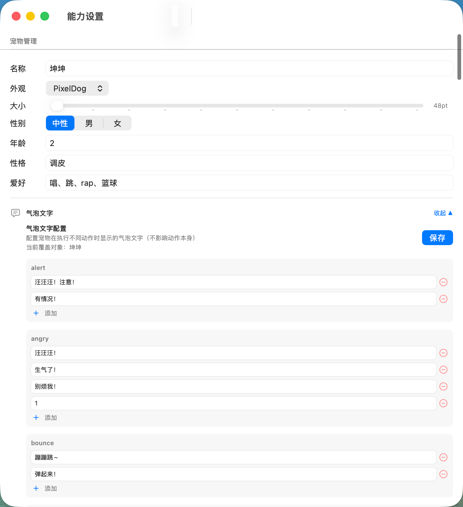
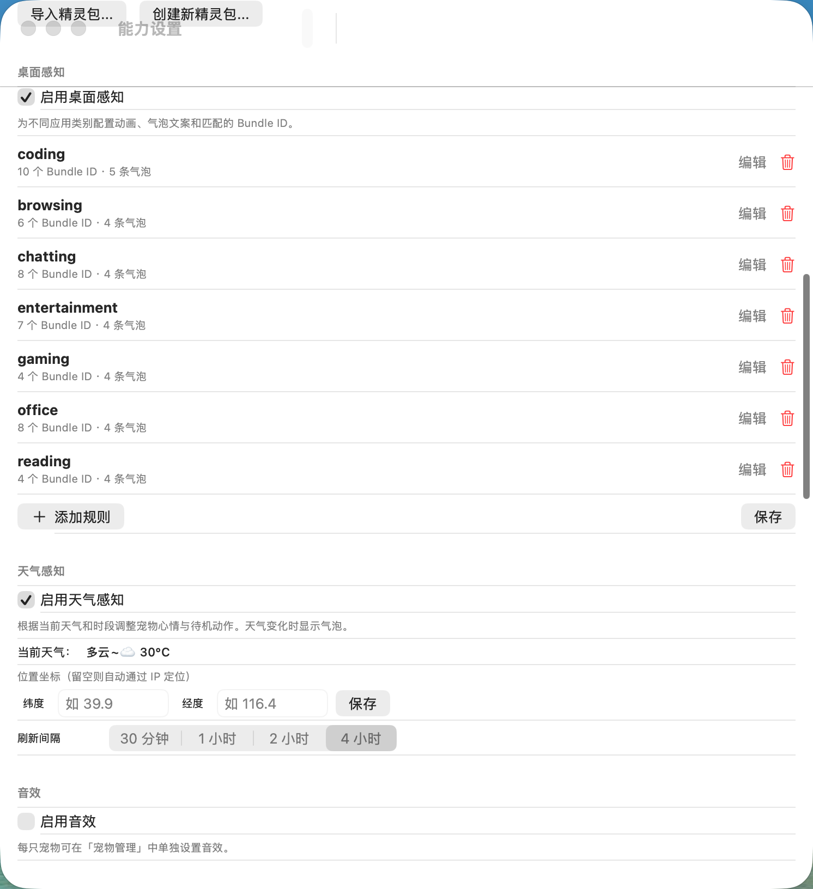
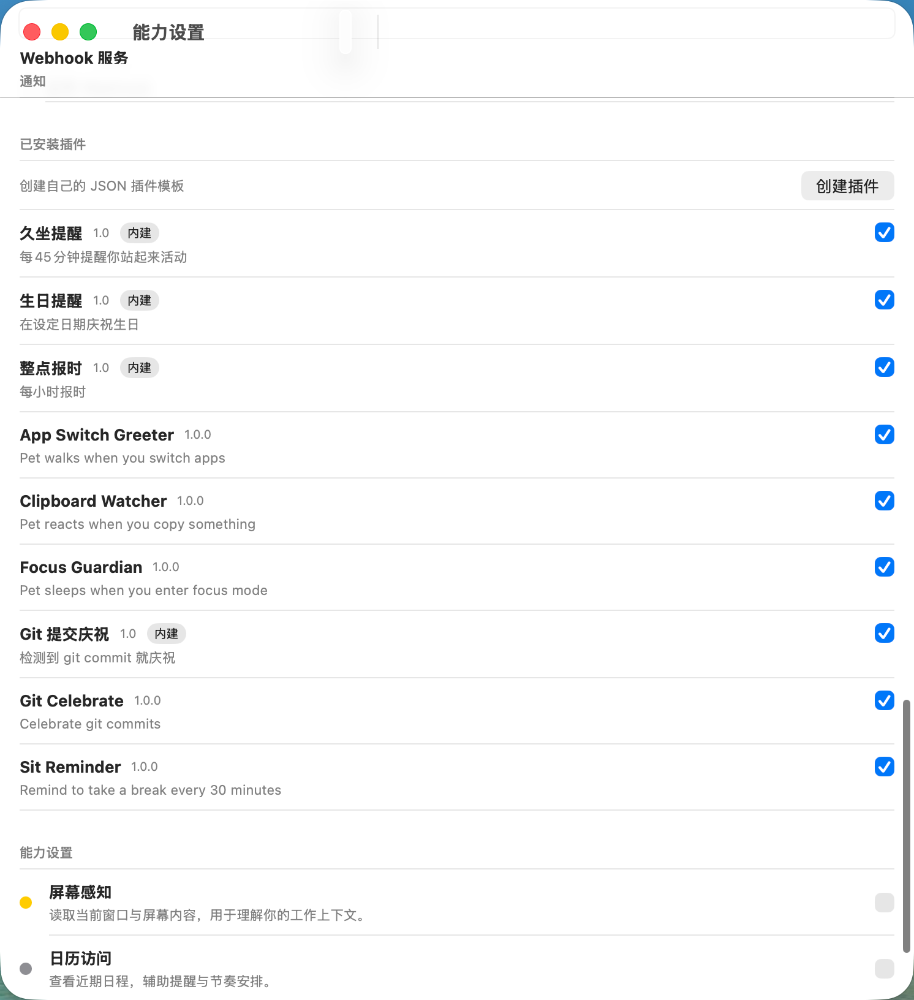
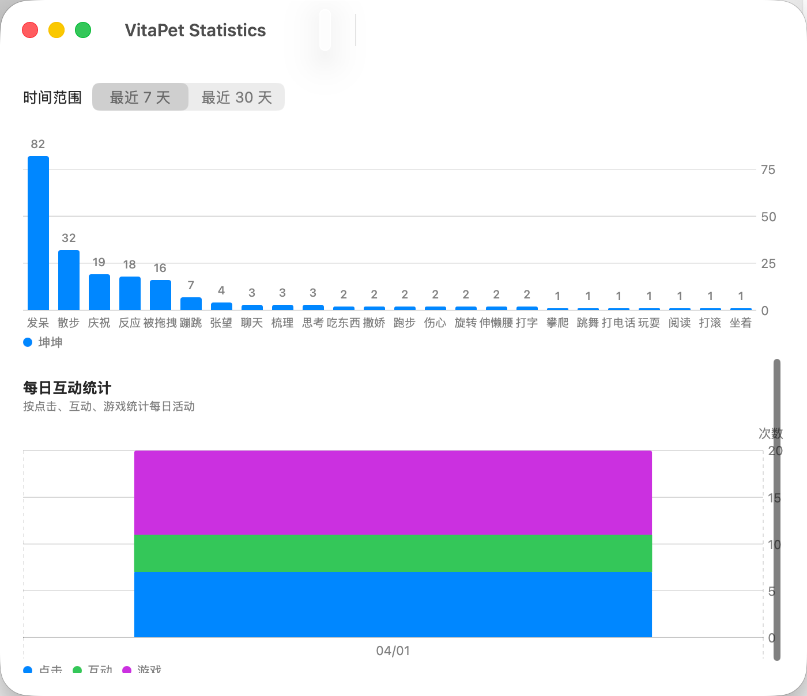
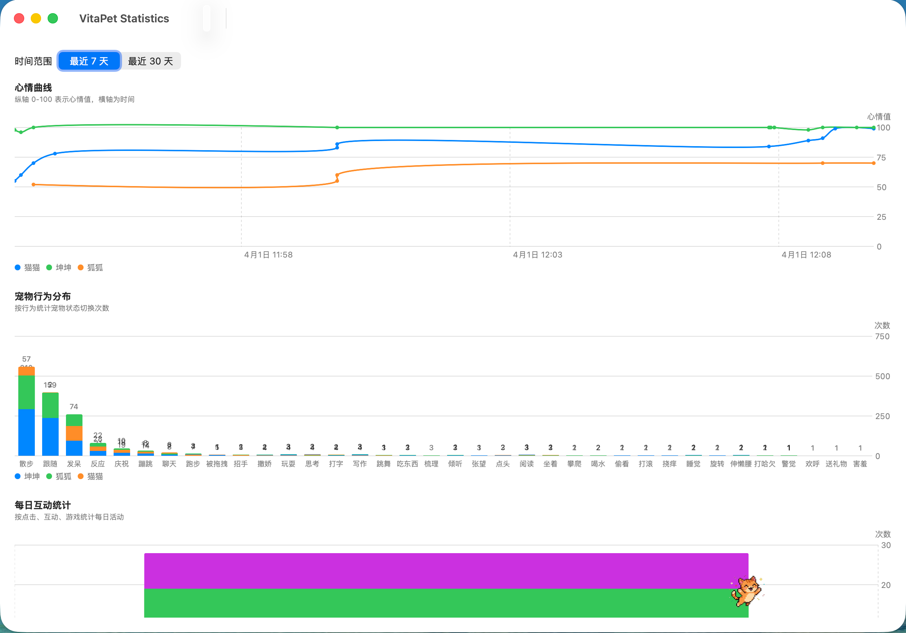

# VitaPet

## 1. 项目介绍

一句话介绍：`VitaPet` 是一个运行在 macOS 桌面上的像素风桌宠应用，会根据你的操作、时间、天气和互动内容实时做出反应。

VitaPet 使用 `Swift 6`、`SpriteKit`、`AppKit`、`SwiftUI` 构建，支持最多 5 只宠物同屏、47 种动画状态、桌面感知、时间与天气感知、小游戏、番茄钟、AI 聊天、统计面板、声明式 JSON 插件，以及可导入导出的自定义精灵包。应用常驻状态栏，通过状态栏菜单完成主要操作，首次启动会自动安装内置精灵包。


### 预览

| 宠物设置 | 桌面感知 / 天气 / 音效 | 插件系统 |
|:---:|:---:|:---:|
|  |  |  |

| 单聊 | 群聊 |
|:---:|:---:|
|  |  |

| 单人游戏 | 多人游戏 |
|:---:|:---:|
|  |  |

| 单宠统计 | 多宠统计 |
|:---:|:---:|
|  |  |

## 2. 安装运行

### 系统要求

| 项目 | 要求 |
| --- | --- |
| 操作系统 | `macOS 14+` |
| Swift | `Swift 6+` |
| 构建方式 | `swift build` |

### 方式 1：下载 Release

从 [GitHub Releases](https://github.com/Songzhibin/VitaPet/releases/latest) 下载最新版 `.zip`，解压后运行 `VitaPetApp`。

### 方式 2：从源码构建

```bash
git clone https://github.com/Songzhibin/VitaPet.git
cd VitaPet
swift build
```

### 运行应用

```bash
.build/debug/VitaPetApp
```

也可以使用：

```bash
swift run VitaPetApp
```

### 首次启动说明

- 首次启动时，应用会自动将内置精灵包安装到 `~/Library/Application Support/VitaPet/SpritePacks/`
- 内置精灵包包含 `PixelCat`、`PixelDog`、`PixelFox`
- 如果内置声明式插件目录为空，应用也会自动安装内置插件

## 3. 快速开始

启动后，你会看到以下变化：

- 状态栏出现 `🐾` 图标
- 桌面出现像素宠物窗口
- 宠物会自动进入待机、行走、互动或环境响应状态

### 状态栏菜单入口

| 入口 | 说明 |
| --- | --- |
| 聊天 | 打开单聊/群聊窗口 |
| 设置 | 打开设置面板 |
| 活动日志 | 查看活动与事件记录 |
| 数据统计 | 查看图表统计 |
| 显示/隐藏宠物 | 控制桌宠可见性 |
| 添加宠物 | 新增一只宠物 |
| 删除宠物 | 删除指定宠物 |
| 小游戏 | 打开小游戏入口 |
| 番茄钟 | 开始、暂停、重置、跳过番茄钟 |
| 宠物大小 | 调整桌宠尺寸 |
| 退出 | 退出应用 |

### 打开设置

- 菜单路径：状态栏 `🐾` → `设置`

### 快捷键

- `cmd+shift+V`：唤出聊天快捷输入栏

## 4. 宠物管理

VitaPet 支持最多同时管理 `5` 只宠物。

### 添加宠物

- 操作路径：状态栏 `🐾` → `添加宠物`
- 上限为 `5` 只；达到上限后无法继续添加

### 删除宠物

- 操作路径：状态栏 `🐾` → `删除宠物`
- 可按宠物实例分别删除，不影响其他宠物

### 编辑宠物

操作路径：`设置` → `宠物管理` → 选择宠物进行编辑。

可编辑内容如下：

| 字段 | 说明 |
| --- | --- |
| 名字 | 宠物显示名称 |
| 外观 / 皮肤 | 选择精灵包 |
| 大小 | 调整桌面显示尺寸 |
| 性别 | 宠物档案属性 |
| 年龄 | 宠物档案属性 |
| 性格 | 影响角色设定与 AI 对话表达 |
| 爱好 | 影响角色设定与 AI 对话表达 |

### 切换精灵包

- 在宠物编辑界面的 `外观` 中选择目标精灵包
- 切换后该宠物会改用新精灵包中的动画、语言包和音效映射
- 内置精灵包 `PixelCat`、`PixelDog`、`PixelFox` 不可删除

## 5. 动画与行为系统

VitaPet 内置 `47` 种动画状态，支持心情驱动、自然过渡、移动行为和窗口附着行为。

### 动画状态完整列表

| 分类 | 状态 |
| --- | --- |
| 基础 | `idle`、`walk`、`run`、`sit`、`sleep` |
| 情绪 | `sad` / `angry` / `shy` / `confused` / `scared` / `love` |
| 互动 | `react`、`celebrate`、`wave`、`nod`、`chat`、`listen` |
| 活动 | `eat`、`drink`、`groom`、`play`、`dance`、`spin`、`roll`、`bounce`、`climb` |
| 工作 | `read`、`write`、`type`、`phone`、`think`、`alert` |
| 其他 | `yawn`、`stretch`、`sneeze`、`scratch`、`peek`、`gift`、`drag`、`follow`、`land`、`pickup`、`hidePeek`、`trip`、`headShake`、`cheer`、`lookAround` |

说明：

- 实际动画资产主要由精灵包 `manifest.json` 提供；缺失时会回退到默认资源

### 行为引擎

- 行为引擎会根据心情 `happy / normal / sad` 选择待机行为
- 时间段和天气会进一步调整行为权重
- 宠物不会机械循环，而是按权重随机选择更自然的动作

### 自然状态转换

典型自然过渡包括：

- 睡觉 → `yawn` → `stretch`
- 跑步 → `walk` → 停下进入 `idle`

### 移动行为

内置移动行为包括：

- `walk`
- `patrol`
- `run`
- `jump`
- `chase`
- `hide`
- `follow`

### 窗口行为

支持桌面窗口感知相关行为：

- `sitOnWindow`：坐在窗口标题栏
- `climb`：沿窗口边缘攀爬

## 6. 宠物互动

互动类型会根据当前宠物数量自动选择，未参与互动的宠物会作为旁观者给出反应。

### 单宠物互动

- `soloPlay`
- `soloGroom`
- `soloExplore`

### 双宠物互动

- `chase`
- `greet`
- `chat`
- `syncDance`

### 三宠物互动

- `triChase`
- `triChat`
- `triPlay`

### 群体互动

- `groupCelebrate`
- `groupSleep`
- `groupFollow`

### 旁观者机制

- 当部分宠物参与互动时，未参与的宠物不会静止
- 旁观宠物会做出围观、响应、表情类反应，形成更自然的群体表现

## 7. 桌面感知

VitaPet 会自动检测当前活动应用，并根据规则切换动画与气泡文字。

### 内置规则分类

| 分类 | 默认动画 | 说明 |
| --- | --- | --- |
| `coding` | `type` | 编程、终端、IDE |
| `browsing` | `read` | 浏览网页 |
| `chatting` | `chat` | 聊天软件 |
| `entertainment` | `dance` | 音乐、视频、娱乐应用 |
| `gaming` | `play` | 游戏启动器和部分游戏 |
| `office` | `write` | 文档、表格、演示、知识管理 |
| `reading` | `read` | 阅读器、PDF、电子书 |

### 每条规则可配置字段

| 字段 | 说明 |
| --- | --- |
| 分类 | 规则名称/分类名 |
| 动画 | 命中规则时使用的主动画 |
| 气泡文字 | 命中规则后周期性显示的文本 |
| 匹配的 Bundle ID | 前台应用匹配规则的依据 |

### 规则管理

- 设置路径：`设置` → `桌面感知`
- 支持编辑、添加、删除规则
- 自定义规则保存在 `~/Library/Application Support/VitaPet/desktop_rules.json`

## 8. 时间与天气感知

时间与天气系统会共同影响宠物心情、待机权重和气泡提示。

### 时间段

应用内置 `6` 个时间段：

- `dawn`
- `morning`
- `afternoon`
- `eveningEarly`
- `evening`
- `night`

### 时间影响

- 不同时段会改变行为权重
- 不同时段会影响心情值，例如清晨更积极、夜间更偏向困倦

### 天气数据来源

- 使用 `Open-Meteo API`
- 免费使用
- 无需 API Key

### 位置获取方式

| 方式 | 说明 |
| --- | --- |
| 手动坐标 | 在设置中填写纬度、经度 |
| 自动定位 | 优先尝试系统定位，失败时回退到 IP 自动定位 |

### 天气反馈

- 天气变化时宠物会显示气泡
- 天气也会影响行为偏好，例如下雨更容易待坐、下雪更容易庆祝

### 刷新间隔

可配置为：

- `30分钟`
- `1小时`
- `2小时`
- `4小时`

## 9. 音效系统

音效系统默认关闭，需要在设置中手动启用。

### 全局设置

- 默认静音
- 设置中可开启全局音效开关
- 设置中可调整全局音量滑块

### 单宠物设置

每只宠物可以独立配置音效策略：

- 跟随全局设置
- 使用该宠物的自定义音效设置

### 物种音效

| 物种 | 典型音效 |
| --- | --- |
| 猫 | 喵叫、呼噜 |
| 狗 | 汪叫、喘气 |
| 狐狸 | 吱叫 |

### 音效资源位置

- 音效跟随精灵包存放
- 音效文件位于精灵包的 `sounds/` 子目录

## 10. 小游戏

小游戏入口位于状态栏菜单，进入游戏后宠物会暂停正常行为，待游戏结束后恢复。

### 小游戏列表

| 游戏 | 玩法说明 |
| --- | --- |
| 赛跑 | 宠物从左到右竞速，途中可能触发绊倒或加速等随机事件 |
| 接东西 | 天降食物，宠物自动移动并追接 |
| 石头剪刀布 | 支持 `1-2` 只宠物参与 |
| 捉迷藏 | 一只负责寻找，其他宠物负责躲藏 |

### 入口

- 状态栏 `🐾` → `小游戏`

### 游戏行为说明

- 游戏期间暂停正常行为系统
- 游戏结束后恢复正常待机与环境响应

## 11. 番茄钟

内置一个简单的桌宠番茄钟。

### 默认节奏

- `25` 分钟工作
- `5` 分钟休息

### 入口

- 状态栏 `🐾` → `番茄钟`
- 支持 `开始`、`暂停`、`重置`、`跳过`

### 宠物反馈

- 工作中宠物会优先表现 `type` 打字动画
- 休息时宠物会优先表现 `stretch` 伸懒腰动画

## 12. AI 聊天

AI 聊天依赖本地 Ollama 服务。

### 运行前提

| 项目 | 说明 |
| --- | --- |
| 服务地址 | 默认使用本地 `localhost:11434` |
| 模型来源 | 由本地 Ollama 提供 |
| 配置位置 | `设置` → `AI 设置` |

### 需要配置的内容

- Ollama 地址
- 模型名称
- 系统提示词

### 聊天模式

| 模式 | 说明 |
| --- | --- |
| 单聊 | 和一只宠物对话 |
| 群聊 | 创建群组，多只宠物同时对话 |

### 群聊特点

- 每只宠物拥有独立性格档案
- 名字、性别、年龄、性格、爱好会影响 AI 回复风格

### 入口

- 状态栏 `🐾` → `聊天`

## 13. 数据统计

统计面板用于查看宠物状态和使用行为。

### 打开方式

- 状态栏 `🐾` → `数据统计`

### 图表内容

| 图表 | 说明 |
| --- | --- |
| 心情曲线 | 折线图，多宠物不同颜色，Y 轴范围 `0-100` |
| 宠物行为分布 | 柱状图，按行为类型统计 |
| 每日互动统计 | 堆叠柱状图，统计点击 / 互动 / 游戏 |

### 时间范围

- `7天`
- `30天`

### 数据保留策略

- 数据自动清理
- 默认仅保留最近 `30` 天

## 14. 插件系统

VitaPet 提供声明式 JSON 插件系统，无需重新编译主程序即可扩展行为。

### 插件目录

```text
~/Library/Application Support/VitaPet/Plugins/
```

### 基本结构

每个插件使用一个独立子目录，目录下包含 `plugin.json`：

```text
Plugins/
└── MyPlugin/
    └── plugin.json
```

### plugin.json 示例

```json
{
  "id": "my-plugin",
  "name": "我的插件",
  "version": "1.0",
  "description": "插件描述",
  "triggers": [
    {
      "event": "timerFired",
      "conditions": {"interval": 3600},
      "actions": [
        {"type": "bubble", "message": "休息一下！"},
        {"type": "mood", "delta": "+5"}
      ]
    }
  ]
}
```

### 事件类型

- `timerFired`
- `appActivated`
- `appDeactivated`
- `fileChanged`
- `custom`

### 动作类型

- `bubble`：显示气泡
- `mood`：调整心情

### 内置插件

- `SitReminder`
- `GitCelebrateJSON`
- `HourlyChime`
- `BirthdayReminder`

### 设置中可管理的操作

- 启用 / 禁用
- 编辑触发规则
- 卸载非内置插件
- 创建插件

## 15. 自定义精灵包（皮肤）

精灵包用于定义动画、气泡语言和声音映射。

### 精灵包目录

```text
~/Library/Application Support/VitaPet/SpritePacks/
```

### 每个精灵包的目录结构

```text
MyPack/
├── manifest.json
├── my_idle_0.png
├── my_walk_0.png
├── my_walk_1.png
└── sounds/
```

### 文件要求

| 文件/目录 | 说明 |
| --- | --- |
| `manifest.json` | 动画与资源定义文件 |
| PNG 帧图 | 命名格式 `{prefix}_{state}_{frame}.png`，例如 `cat_idle_0.png` |
| `sounds/` | 可选，存放音效资源 |

### manifest.json 示例

```json
{
  "name": "我的皮肤",
  "version": "1.0",
  "states": {
    "idle": {"frames": ["my_idle_0"], "frameInterval": 0.5, "loop": true},
    "walk": {"frames": ["my_walk_0", "my_walk_1"], "frameInterval": 0.2, "loop": true}
  },
  "language": {
    "react": ["你好！", "嘿！"],
    "idle": ["无聊~"]
  },
  "sounds": {
    "react": "sounds/react.wav",
    "walk": "sounds/walk.wav"
  }
}
```

### 必要条件

- 必须包含 `idle` 状态
- 动画帧名需与 PNG 文件一致
- 未提供的状态会按当前精灵包/默认资源的可用情况回退

### 导入导出

- 设置中可导入精灵包目录或 `.zip`
- 设置中可导出精灵包
- 设置中可创建模板精灵包，便于二次修改

### 内置精灵包限制

- `PixelCat`
- `PixelDog`
- `PixelFox`

以上内置精灵包不可删除。

## 16. 自定义音效

自定义音效依附于精灵包管理。

### 规则

- 音效文件放在精灵包的 `sounds/` 子目录
- 通过 `manifest.json` 的 `sounds` 字段建立动作到音频文件的映射
- 支持 `WAV` 格式
- 没有映射的动作默认静音

### 示例

```json
{
  "sounds": {
    "react": "sounds/react.wav",
    "walk": "sounds/walk.wav",
    "celebrate": "sounds/celebrate.wav"
  }
}
```

## 17. 自定义语言包（气泡文字）

气泡语言包同样放在精灵包 `manifest.json` 内。

### 配置位置

- 模板级：精灵包 `manifest.json` 的 `language` 字段
- 实例级：`设置` → `宠物管理` → `编辑` → `气泡文字`

### 工作方式

- 每个动作可以配置多条气泡文本
- 触发该动作时会随机显示其中一条
- 实例级自定义只影响当前宠物，不会修改精灵包模板本身

### 还原

- 可通过 `还原语言` 恢复默认文本

## 18. 设置说明

打开方式：

- 快捷键 `cmd+,`
- 状态栏 `🐾` → `设置`

### 设置分区总览

| 分区 | 说明 |
| --- | --- |
| 宠物管理 | 编辑 / 添加 / 删除 / 还原宠物实例 |
| 精灵包 | 只读展示、导入、导出、创建模板 |
| 桌面感知 | 开关、规则编辑 |
| 天气感知 | 开关、坐标、刷新间隔 |
| 音效 | 全局开关、音量 |
| AI 设置 | Ollama 地址、模型、系统提示词 |
| 通知 | GitHub Token、Webhook 等通知能力 |
| 插件 | 启用、编辑、卸载、创建 |

### 重点说明

#### 宠物管理

- 可编辑名字、皮肤、大小、档案属性、语言和音效策略
- 可还原语言、还原属性、还原全部设置

#### 精灵包

- 浏览所有可用精灵包
- 导入目录或 `.zip`
- 导出自定义精灵包
- 创建空模板进行二次创作

#### 桌面感知

- 开关桌面感知
- 配置分类、动画、气泡文字、Bundle ID

#### 天气感知

- 启用或关闭天气感知
- 配置纬度、经度
- 设置刷新间隔

#### 音效

- 全局静音开关
- 全局音量
- 每只宠物可配置跟随全局或独立设置

#### AI 设置

- 设置 Ollama 地址
- 选择模型
- 配置系统提示词

#### 通知

- 用于与 GitHub、Webhook 等外部触发源联动

#### 插件

- 管理已安装插件
- 直接编辑 `plugin.json`
- 卸载非内置插件

## 19. 项目结构

项目以可执行应用 + 多模块库的方式组织。

### 顶层结构

```text
VitaPet/
├── App/Sources/
├── Modules/
├── Plugins/
├── Package.swift
└── README.md
```

### 模块职责

| 模块 | 职责 |
| --- | --- |
| `App/Sources` | 主应用入口、状态栏、桌宠窗口、小游戏、番茄钟、时间天气控制、桌面感知协调 |
| `Modules/RenderEngine` | 动画状态、精灵包加载、行为引擎、Sprite 渲染与状态机 |
| `Modules/EventBus` | 应用事件总线、工作区监控、文件变化、通知、定时器、桌面规则 |
| `Modules/Persistence` | 配置持久化、宠物档案、数据库、日志 |
| `Modules/ChatUI` | 设置界面、聊天窗口、统计面板、活动日志 UI |
| `Modules/AIEngine` | Ollama 服务接入与 AI 对话能力 |
| `Modules/PluginRuntime` | 声明式 JSON 插件加载、触发规则匹配、动作执行 |
| `Modules/PluginSDK` | 原生插件接口（预留，当前未启用） |
| `Modules/PluginProtocols` | 插件协议定义（预留，当前未启用） |
| `Modules/FocusMonitor` | 专注状态与前台窗口监控 |
| `Modules/Localization` | 多语言文案资源 |
| `Modules/SecurityLayer` | 权限能力定义与访问控制 |
| `Plugins/GitCelebrate` | 原生插件示例（实验性，当前未启用；声明式 JSON 版本 `GitCelebrateJSON` 为实际使用的内置插件） |

## 20. 许可证

本项目使用 `Apache 2.0` 许可证。
